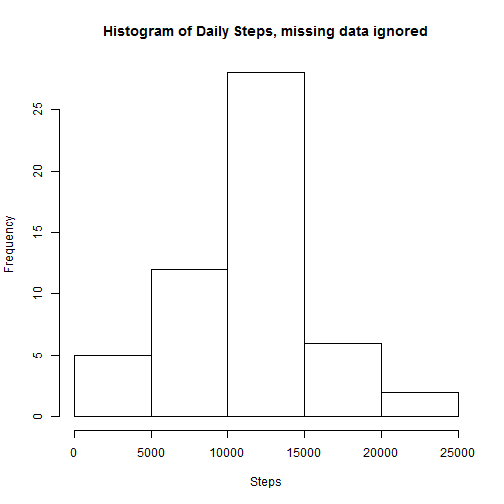
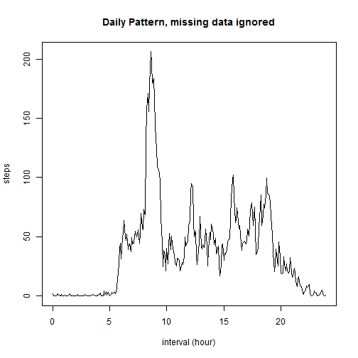
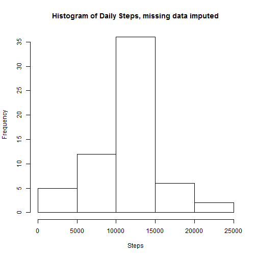
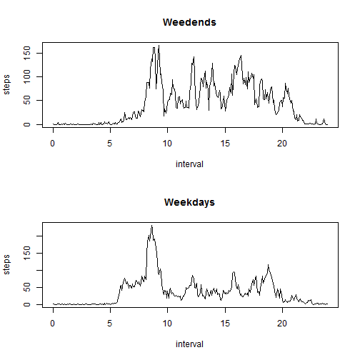

## Loading and preprocessing the data

Note:The function is to eliminate the artifact of straight lines showing in the line plots at the end of each hour. Now interval is in hour. 


```r
setwd("C:/Users/Kenneth/Documents/R/RepData_PeerAssessment1")
data<-read.csv("activity.csv")
interval<-function(x){
    hour<-floor(x/100)
    min <- x-hour*100
    return(hour+min/60)
    }
data$interval<-interval(data$interval)
```

## What is mean total number of steps taken per day?
1. Get total activity by date
2. Do histrogram
3. Get Median and Main
4. Note - Missing data are ignored


```r
byDate<-aggregate(steps~date, data, sum)
hist(byDate$steps,main="Histogram of Daily Steps, missing data ignored", xlab="Steps")
```

 

```r
summary(byDate$steps)[c("Median","Mean")]
```

```
## Median   Mean 
##  10760  10770
```

## What is the average daily activity pattern?
1.Get average daily activity by time intervals
2.Plot line graph by interval (in hour)
3.Show the interval where max occurs. It is 8:35 if shown is hour-minute format.

```r
byInt<-aggregate(steps~interval, data, mean)
plot(byInt,type="l",xlab="interval (hour)",main="Daily Pattern, missing data ignored")
```

 

```r
max<-max(byInt$steps)
subset(byInt,steps==max)
```

```
##     interval    steps
## 104 8.583333 206.1698
```


## Imputing missing values
1. Get number of missing data entries
2. replace missing data with average value of the time interval
3. redo line plot
4. redo histogram
5. Even though there are about 13% increase in data. The median and mean are not changed by much.

```r
nrow(subset(data,is.na(steps) ))
```

```
## [1] 2304
```

```r
data2<-merge(data,byInt,by="interval")
names(data2)<-c("interval", "orig","date","ave")
data2$steps<-ifelse(is.na(data2$orig),data2$ave,data2$orig)
byInt2<-aggregate(steps~interval, data2, mean)
plot(byInt2,type="l",xlab="interval (hour)",main="Daily Pattern, missing data imputed")
```

 

```r
byDate2<-aggregate(steps~date, data2,sum)
hist(byDate2$steps,main="Histogram of Daily Steps, missing data imputed", xlab="Steps")
```

 

```r
summary(byDate2$steps)[c("Median","Mean")]
```

```
## Median   Mean 
##  10770  10770
```


## Are there differences in activity patterns between weekdays and weekends?
Seperating data by weekend and weekday. We see the weekend activy is higher.


```r
library(chron)
data2$weekend<-is.weekend(as.Date(data2$date,"%Y-%m-%d"))
byInt_wd<-aggregate(steps~interval,subset(data2,weekend==FALSE),mean)
byInt_we<-aggregate(steps~interval,subset(data2,weekend==TRUE),mean)
old.par <- par(mfrow=c(2, 1))
plot(byInt_we,type="l",main="Weedends")
plot(byInt_wd,type="l",main="Weekdays")
```

 

```r
par(old.par)
```
